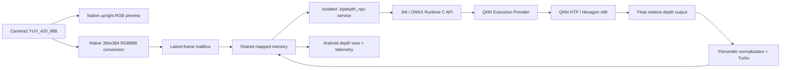

# ZipDepth on Snapdragon 888 HTP

An Android reference application that runs a quantized
[ZipDepth](https://github.com/fabiotosi92/ZipDepth) monocular-depth model on the
Snapdragon 888 neural accelerator. Camera capture, model preprocessing, Qualcomm
NPU execution, depth visualization, performance telemetry, camera selection,
and on-device camera calibration are included in one standalone project.

This repository targets the **Qualcomm Snapdragon 888 Mobile Platform**
(**SM8350**, board name **lahaina**) and its **Qualcomm Hexagon 780 Processor**.
More precisely, inference uses the **QNN HTP backend** for **Hexagon architecture
v68**, reached through FastRPC on the compute DSP. Qualcomm markets this as part
of the 6th-generation Qualcomm AI Engine; the complete AI Engine is rated at up
to 26 TOPS, which is a platform-level figure rather than this model's measured
throughput.

> [!IMPORTANT]
> The bundled model is a precompiled SM8350/v68 QNN context. The native layer
> deliberately rejects other SoCs instead of silently falling back to CPU. To
> support a different Snapdragon generation, regenerate the QNN context for its
> HTP architecture and package the matching QAIRT runtime libraries.

## Runtime stack

| Layer | This project |
|---|---|
| Model | ZipDepth, 384 x 384, relative monocular depth |
| Quantization | INT8-quantized QNN graph with float32 graph boundaries |
| Model container | ONNX `EPContext` model with embedded QNN context binary |
| Inference API | ONNX Runtime 1.27.0 C API |
| Execution provider | ONNX Runtime QNN Execution Provider |
| Qualcomm runtime | Qualcomm AI Runtime (QAIRT/QNN) 2.48 |
| Accelerator backend | QNN HTP backend, Hexagon v68 |
| Target SoC | Snapdragon 888 / SM8350 / lahaina |
| Hexagon processor | Qualcomm Hexagon 780 Processor |
| Android ABI | `arm64-v8a` only |
| Camera API | Camera2 `YUV_420_888` |

The QNN execution provider is opened with `libQnnHtp.so`. CPU execution-provider
fallback is disabled for the strict session. A compatibility retry permits CPU
I/O boundary nodes, but the compiled ZipDepth graph remains an HTP context. The
application never presents a CPU result as NPU inference.

## What the application demonstrates

- Live Camera2 RGB preview and selectable physical/logical camera IDs.
- Native YUV-to-RGB conversion, orientation correction, square center crop, and
  384 x 384 resize shared by the preview and model input.
- Quantized ZipDepth execution through ONNX Runtime QNN EP on Hexagon HTP.
- Camera capture and HTP inference in separate Android processes.
- Latest-frame backpressure: the camera never waits for the NPU and stale model
  inputs are replaced instead of queued.
- Shared mapped memory for the 384 x 384 RGB input and ARGB depth result; Binder
  carries only small control messages.
- Live camera FPS, delivered depth FPS, `OrtRun` time, native processing time,
  IPC round trip, and capture-to-result latency.
- Camera selection with Camera2 ID, facing, focal length, and analysis size.
- On-device checkerboard calibration with per-camera intrinsics stored in the
  application's private data directory.
- Explicit errors when the SoC, QNN runtime, model, camera, or inference call is
  unsupported or fails.

The upper half of the UI shows the exact upright square RGB crop consumed by the
model. The lower half shows the corresponding relative-depth result. Depth is
normalized with a temporally smoothed 2nd-to-98th percentile window and rendered
with a Turbo colormap; warmer colors represent nearer content.

## Architecture



The camera activity is only a producer. The NPU service never opens or references
the camera. This separation keeps Camera2 buffer ownership out of the QNN process
and makes stalls visible without freezing the preview.

## Tested hardware and representative performance

The current build has been exercised on a Sony Xperia 1 III / SO-51B with a
Snapdragon 888. After warm-up, observed QNN HTP `OrtRun` time is commonly around
**40-60 ms** at 384 x 384. Delivered FPS varies with the selected camera stream,
thermal state, display work, and device firmware, so treat this as a functional
reference measurement rather than a controlled benchmark.

The application logs the backend and graph-placement result at startup. A valid
session reports one of:

```text
QNN HTP - EPContext - all nodes
QNN HTP - EPContext - CPU I/O boundary
```

## Requirements

### Host

- Git with [Git LFS](https://git-lfs.com/) enabled.
- Android Studio or JDK 17+.
- Android SDK 34.
- Android NDK `21.4.7075529`.
- CMake 3.22.1.
- ADB for device installation and diagnostics.
- Python 3 with Tk support only if using the fullscreen calibration target.

### Device

- Snapdragon 888 / SM8350 / lahaina.
- 64-bit Android (`arm64-v8a`), API level 26 or newer.
- A Camera2 camera exposing `YUV_420_888`.
- Qualcomm FastRPC/CDSP support available through the device firmware.

## Clone and build

The model and native runtime artifacts are tracked with Git LFS. Pulling a source
archive without LFS objects will not produce a working APK.

```powershell
git lfs install
git clone <your-repository-url>
cd zipdepth_NPU
git lfs pull
```

Open the directory in Android Studio, or build from PowerShell:

```powershell
.\gradlew.bat assembleDebug
```

Android Studio normally creates `local.properties` automatically. For a manual
command-line setup, it must point at the local Android SDK and must not be
committed.

The debug APK is written to:

```text
app/build/outputs/apk/debug/app-debug.apk
```

Install and launch it:

```powershell
adb install -r app/build/outputs/apk/debug/app-debug.apk
adb shell am start -n org.zipdepth.npudemo/.MainActivity
```

Grant camera permission when Android prompts for it.

## Interpreting the telemetry

| Label | Measurement |
|---|---|
| `CAM` | Camera2 frames delivered to the application |
| `DEPTH` | Completed depth results after latest-frame backpressure |
| `HTP` | `OrtApi::Run` duration for the QNN EPContext graph |
| `NATIVE` | RGB tensor conversion, HTP execution, depth normalization, colormap, and JNI copying |
| `ROUND` | Shared-memory dispatch, native work, and result IPC |
| `E2E` | Selected camera frame capture through result delivery to the activity |

An `HTP WAIT` value means an inference request remains outstanding. The RGB
preview should continue because it does not wait on that request.

## Camera calibration

Tap **Calibrate camera** to pause new depth submissions while keeping Camera2 and
the RGB preview live. The app detects a checkerboard, accepts 12 sufficiently
different views, rejects reprojection outliers, validates the resulting camera
matrix, and saves one JSON file per camera ID and analysis resolution.

Display the host target with:

```powershell
python calibration_target/show_calibration_target.py
```

Useful options:

```powershell
python calibration_target/show_calibration_target.py --list-monitors
python calibration_target/show_calibration_target.py --monitor 1
```

The target contains 11 x 8 squares, producing the 10 x 7 inner corners expected
by the app. Move the target through the image center and edges, vary distance,
and include horizontal and vertical tilt. Press Escape or Q to close it.

Successful calibration files are stored under:

```text
files/camera-calibration/<camera-id>_<width>x<height>.json
```

For this debuggable build, a result can be inspected with:

```powershell
adb shell run-as org.zipdepth.npudemo cat files/camera-calibration/0_960x720.json
```

The stored values describe the unrotated Camera2 YUV analysis stream and include
`fx`, `fy`, `cx`, `cy`, skew, Brown-Conrady distortion coefficients, resolution,
RMS reprojection error, sample count, and timestamp. The current demo records
and displays calibration status; it does **not yet undistort the ZipDepth input**.

## Logs and troubleshooting

Filter the useful runtime messages with:

```powershell
adb logcat -s ZipDepthDemo onnxruntime CameraCalibration
```

Common cases:

- **Unsupported SoC**: the bundled context is specifically compiled for
  SM8350/v68. Rebuild the context for the target HTP architecture.
- **QNN initialization failure**: confirm that the QAIRT libraries, ONNX Runtime
  AAR, and EPContext model are the matched versions listed in
  [`DEPENDENCIES.md`](DEPENDENCIES.md).
- **FastRPC or skeleton loading failure**: confirm that `libcdsprpc.so` is exposed
  by the firmware and `libQnnHtpV68Skel.so` is packaged as a real filesystem
  library. Legacy JNI packaging is intentional for this reason.
- **First frame is slow**: initialization performs one warm-up inference so the
  live stream does not absorb QNN's first-run graph finalization cost.
- **Camera remains live but depth stops**: inspect the last native stage in
  logcat and the on-screen `HTP WAIT` duration.

## Repository layout

```text
app/src/main/java/.../MainActivity.kt              Camera, UI, metrics, IPC
app/src/main/java/.../ZipDepthService.kt            Isolated NPU service
app/src/main/java/.../CameraCalibrationController.kt Calibration and storage
app/src/main/cpp/zipdepth_jni.c                     Pre/postprocessing + ORT C API
app/src/main/assets/zipdepth.onnx                   SM8350/v68 EPContext model
app/src/main/jniLibs/arm64-v8a/                     Matched QAIRT/QNN runtime
app/libs/onnxruntime-android-qnn-1.27.0.aar          ORT Android QNN build
calibration_target/                                 Python target and instructions
DEPENDENCIES.md                                     Binary inventory and hashes
THIRD_PARTY_NOTICES.md                              Upstream projects and terms
```

## Scope and limitations

- This is a hardware-specific deployment example, not a portable ONNX model
  runner.
- Output is relative, non-metric monocular depth.
- The bundled context does not support MediaTek, Exynos, Tensor, or a different
  Snapdragon HTP architecture.
- There is no CPU model fallback by design; performance labels remain honest.
- Thermal behavior and camera/NPU concurrency are device- and firmware-specific.
- The project is not affiliated with or endorsed by the ZipDepth authors,
  Qualcomm, Microsoft, OpenCV, Sony, or Google.

## Upstream work and citation

ZipDepth is the work of Fabio Tosi, Luca Bartolomei, Matteo Poggi, and Stefano
Mattoccia. Refer to the [official ZipDepth repository](https://github.com/fabiotosi92/ZipDepth)
for training, evaluation, original checkpoints, and the paper citation:

```bibtex
@inproceedings{tosi2026zipdepth,
  title     = {ZipDepth: Bringing Lightweight Zero-Shot Monocular Depth Anywhere, on Any Device},
  author    = {Tosi, Fabio and Bartolomei, Luca and Poggi, Matteo and Mattoccia, Stefano},
  booktitle = {European Conference on Computer Vision (ECCV)},
  year      = {2026}
}
```

## Licensing and redistribution

The original application source is released under the permissive
[BSD Zero Clause License](LICENSE) (`0BSD`). Third-party components retain their
own licenses:

| Component | License |
|---|---|
| ZipDepth NPU Demo application code | 0BSD |
| ZipDepth model and upstream code | MIT |
| ONNX Runtime | MIT |
| OpenCV 4.12 | Apache-2.0 |
| Qualcomm QAIRT/QNN runtime objects | Qualcomm AI Stack License |

Qualcomm's AI Stack License permits QAIRT software to be distributed and
sublicensed in object-code form when incorporated into an application; it does
not permit standalone QAIRT redistribution. The QNN objects in this repository
are included only as components of this Android app and are expressly excluded
from the 0BSD grant. Keep Qualcomm's proprietary notices intact and do not
extract or republish the objects as a separate runtime or SDK.

See [`THIRD_PARTY_NOTICES.md`](THIRD_PARTY_NOTICES.md) and the
[`Qualcomm QAIRT licensing reference`](LICENSES/Qualcomm-QAIRT-TERMS.md) for the
component boundaries and official references.

## References

- [ZipDepth](https://github.com/fabiotosi92/ZipDepth)
- [Snapdragon 888 5G Mobile Platform](https://www.qualcomm.com/smartphones/products/8-series/snapdragon-888-5g-mobile-platform)
- [Qualcomm AI Engine Direct / QAIRT documentation](https://docs.qualcomm.com/bundle/publicresource/topics/80-87189-1/overview.html)
- [ONNX Runtime QNN Execution Provider](https://onnxruntime.ai/docs/execution-providers/QNN-ExecutionProvider.html)
- [ONNX Runtime EPContext design](https://onnxruntime.ai/docs/execution-providers/EP-Context-Design.html)
- [OpenCV camera calibration](https://docs.opencv.org/4.12.0/d4/d94/tutorial_camera_calibration.html)
